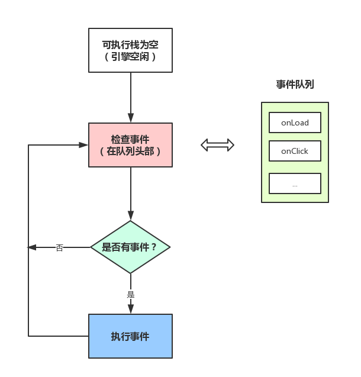

本想写写`Promise`的，但是查阅相关博客的时候发现浏览器进程、JS事件循环机制、宏任务和微任务需要提前学习一下，于是有了这篇博客。
[参考链接](https://segmentfault.com/a/1190000012925872?utm_source=tag-newest)
# 区分进程和线程
用个形象的比喻：
> - 进程是一个工厂，工厂有自己独立的资源
- 工厂之间相互独立
- 线程是工厂中的工人，多个工人协作完成任务
- 工厂内有一个或多个工人
- 工人之间共享空间

引申为计算机线程进程：
> - 进程是一个工厂，工厂有自己独立的资源 -> 系统分配的内存（独立的一块内存）
- 工厂之间相互独立 -> 进程之间相互独立
- 线程是工厂中的工人，多个工人协作完成任务 -> 多个线程在进程中相互协作完成任务
- 工厂内有一个或多个工人 -> 一个进程由一个或多个线程组成
- 工人之间共享空间 -> 同一进程下各个线程之间共享程序的内存空间（如代码段、数据集、堆等）

# 浏览器是多进程的
1. Browser进程，浏览器的主进程（负责协调，主控），只有一个，作用有：
    * 负责浏览器界面的显示，与用户交互。如前进、后退等
    * 负责各页面的管理，创建和销毁其他进程
    * 将Renderer进程得到的内存中的bitmap绘制到用户界面上
    * 网络资源的管理，下载等
2. 第三方插件进程：每种类型的插件对应一个进程，仅当使用该插件时才创建
3. GPU进程：最多一个，用于3D绘制等
4. 浏览器渲染进程（浏览器内核）（Renderer进程，内部是多线程的）：默认每个Tab页面一个进程，互不影响，主要用于页面渲染，脚本执行，事件处理等
**强调：**浏览器中打开一个网页相当于新起了一个进程（进程内有自己的多线程），也有可能多个合并成一个，通过Chrome的`更多工具 -> 任务管理器`可以查看

# 浏览器多进程的优势
* 避免单个page crash影响整个浏览器
* 避免第三方插件crash影响整个浏览器
* 多进程充分利用多核优势
* 方便使用沙盒模型隔离插件等进程，提高浏览器稳定性
简单理解：如果浏览器是单进程，那么某个Tab页或者某个插件崩溃了，就影响整个浏览器
当然，内存等资源消耗也会更大，有点空间换时间的意思。

# 重点来了，浏览器内核（渲染进程）
对于前端来说，页面的渲染、JS的执行、事件的循环都在这个进程中进行。
**浏览器的渲染进程是多线程的**。
浏览器的渲染进程包括哪些线程：
1. GUI渲染进程
    * 负责渲染浏览器界面，解析HTML、CSS，构建DOM树和RenderObject树，布局和绘制
    * 当界面需要重绘（Repaint)或由于某种操作引发回流（reflow)时，该线程就会执行
    * **GUI渲染进程与JS引擎线程是互斥的**，当JS引擎执行时GUI线程会被挂起（相当于被冻结了），GUI更新会被保存在一个队列中，**等到JS引擎空闲时**立即被执行。
2. JS引擎线程
    * 也称JS内核，负责处理JS脚本程序。例如V8引擎
    * JS引擎一直等待着任务队列中任务的到来，然后加以处理，一个Tab页（Renderer进程）中无论什么时候都只有一个JS引擎线程在运行JS程序
    * **GUI渲染进程与JS引擎线程是互斥的**，所以如果JS执行的时间过长，页面渲染就不连贯。
3. 事件触发线程
    * 归属于浏览器而不是JS引擎，用来控制事件循环（可以理解为：JS引擎自己都忙不过来，需要浏览器另开线程协助）
    * 当JS引擎执行代码块和setTimeout时（也可来自浏览器内核的其他线程，如鼠标点击、ajax异步请求等），会将对应事件任务添加到事件线程中
    * 当对应的事件符合触发条件被触发时，该线程会把事件添加到待处理队列的尾部，等待JS引擎的处理
    * **由于JS是单线程关系，所以这些待处理队列中的事件都得排队等待JS引擎处理（当JS引擎空闲时才会去执行）**
4. 定时触发器线程
    * 传说中的`setInterval`和`setTimeout`所在的线程
    * 浏览器定时计数器并不是由JS引擎计数的，因为JS引擎是单线程的，如果处于阻塞线程状态就会影响计时的准确性
    * 因此通过定时触发器线程来计时并触发定时，计时完毕后，添加到事件队列中，等待JS引擎空闲后执行
    * **W3C在HTML标准中规定，要求setTimeout中低于4ms的时间间隔算4ms**
5. 异步http请求线程
    * XMLHttpRequest在连接后是通过浏览器新开一个线程请求
    * 在检测到状态变更时，如果设置有回调函数，异步线程就产生状态变更事件，将这个回调再放入事件队列中，再由JS引擎执行

# Browser进程和浏览器内核（Renderer进程）如何通信
* Browser进程收到用户请求，首先需要获取页面内容（比如通过网络下载资源），随后将该任务通过RendererHost接口传递给Renderer进程
* Renderer进程的RendererHost接口收到消息，简单解释后，交给渲染线程，然后开始渲染
    * 渲染线程接收到请求，加载网页并渲染网页，这其中可能需要Browser进程获取资源和需要GPU进程来帮助渲染
    * 当然可能会有JS引擎线程操作DOM（这样可能会造成回流并重绘）
    * 最后Renderer进程将结果传递给Browser进程
* Browser进程接收到结果并将结果绘制出来


# 梳理浏览器渲染流程
简化前期工作：
> 浏览器输入url，浏览器Browser主进程接管，开一个下载线程
然后进行http请求（略去DNS查询，IP寻址等等操作），然后等待响应，获取内容
得到内容就将内容通过RendererHost接口转交给Renderer进程
浏览器渲染流程开始

浏览器内核拿到内容后，渲染大概可以划分成以下几个步骤：
1. 解析html创建dom树
2. 解析css构建render树（将css解析成树形结构，然后结合DOM合并成render树）
3. 布局render树（layout/reflow），负责各元素尺寸、位置的计算
4. 绘制render树（paint)，绘制页面像素信息
5. 浏览器将各层的信息发送给GPU，GPU会将各层合成（composite）显示在页面上
所有详细步骤已略去，渲染完毕后就是load事件了，之后就是自己的JS逻辑处理了


# 从Event Loop谈JS的运行机制
理解一个概念：
* JS分为同步任务和异步任务
* 同步任务都在主线程上执行，形成一个执行栈
* 主线程之外，**事件触发线程**管理着一个`任务队列`，只要异步任务有了运行结果，就在`任务队列`之中放置一个事件。
* 一旦`执行栈`中的所有同步任务执行完毕（此时JS引擎空闲），系统就会读取`任务队列`，将可运行的异步任务添加到可执行栈中，开始执行。

看到这里，应该就可以理解了：为什么有时候setTimeout推入的事件不能准时执行？因为可能在它推入到事件列表时，主线程还不空闲，正在执行其它代码，所以自然有误差。

# 事件循环机制进一步补充

上图大致描述就是：
* 主线程运行时会产生执行栈，
* 栈中的代码调用某些api时，它们会在事件队列中添加各种事件（当满足触发条件后，如ajax请求完毕）
* 而栈中的代码执行完毕，就会读取事件队列中的事件，去执行那些回调
* 如此循环
* 注意，总是要等待栈中的代码执行完毕后才会去读取事件队列中的事件

# 事件循环进阶：macrotask与microtask
先看一道面试题：
```javascript
console.log('script start');
setTimeout(function() {
    console.log('setTimeout');
}, 0);
Promise.resolve().then(function() {
    console.log('promise1');
}).then(function() {
    console.log('promise2');
});
console.log('script end');
```
打印顺序:
```javascript
    'script start'
    'script end'
    'promise1'
    'promise2'
    'setTimeout'
```
为什么呢？因为Promise里有了一个一个新的概念：`microtask`。
或者，进一步，JS中分为两种任务类型：`macrotask`和`microtask`，在ECMAScript中，`microtask`称为`jobs`，`macrotask`可称为`task`
它们的定义？区别？简单点可以按如下理解：
* `macrotask`（又称之为宏任务），可以理解是每次执行栈执行的代码就是一个宏任务（包括每次从事件队列中获取一个事件回调并放到执行栈中执行）
    * 每一个task会从头到尾将这个任务执行完毕，不会执行其它
    * 浏览器为了能够使得JS内部task与DOM任务能够有序的执行，会在一个task执行结束后，在下一个 task 执行开始前，对页面进行重新渲染
（`task->渲染->task->...`）
* `microtask`（又称为微任务），可以理解是在当前task执行结束后立即执行的任务
    * 也就是说，在当前task任务后，下一个task之前，在渲染之前
    * 所以它的响应速度相比setTimeout（setTimeout是task）会更快，因为无需等渲染
    * **也就是说，在某一个macrotask执行完后，就会将在它执行期间产生的所有microtask都执行完毕（在渲染前）**
分别是怎样的场景会形成macrotask和microtask呢？
* macrotask：主代码块，setTimeout，setInterval等（可以看到，事件队列中的每一个事件都是一个macrotask）
* microtask：Promise，process.nextTick等
__补充：在node环境下，process.nextTick的优先级高于Promise__，也就是可以简单理解为：在宏任务结束后会先执行微任务队列中的nextTickQueue部分，然后才会执行微任务中的Promise部分。
再根据线程来理解下：
* macrotask中的事件都是放在一个事件队列中的，而这个队列由事件触发线程维护
* microtask中的所有微任务都是添加到微任务队列（Job Queues）中，等待当前macrotask执行完毕后执行，而这个队列由JS引擎线程维护
（这点由自己理解+推测得出，因为它是在主线程下无缝执行的）
所以，**总结下运行机制**：
* 执行一个宏任务（栈中没有就从事件队列中获取）
* 执行过程中如果遇到微任务，就将它添加到微任务的任务队列中
* 宏任务执行完毕后，立即执行当前微任务队列中的所有微任务（依次执行）
* 当前宏任务执行完毕，开始检查渲染，然后GUI线程接管渲染
* 渲染完毕后，JS线程继续接管，开始下一个宏任务（从事件队列中获取）
