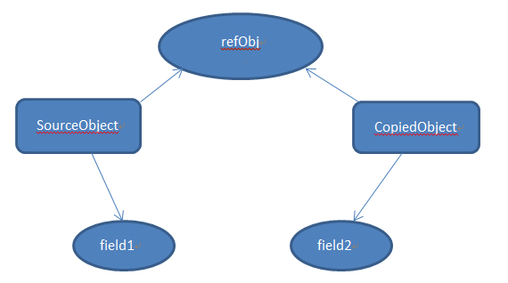
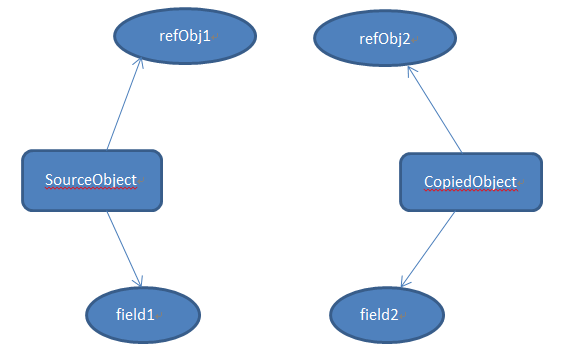

中秋快乐！

今天放假，想总结一下赋值、浅拷贝和深拷贝的区别。
# **赋值（Copy）**
赋值是将某一数值或对象赋给某个变量的过程，分两种情况：
* 基本数据类型：赋值，赋值后两个变量互不影响
* 引用数据类型: 赋**址**，两个变量指向同一个地址，同一个对象，相互之间有影响

对基本数据类型的赋值，两个变量相互不影响：
```javascript
var a = 1;
var b = a;
a = 2;
console.log(a); // 2
console.log(b); // 1
```
对引用数据类型进行赋址操作，两个变量指向同一个对象，改变变量a的值会影响变量b的值，哪怕改变的只是对象a中的基础数据类型：
```javascript
var a = {
    name: 'Jane',
    book: {
        name: 'Vue.js',
        price: 50
    }
};
var b = a;
b.name = 'hahaha';
b.book.price = 52;
console.log(a); // { name: 'hahaha', book: { name: 'Vue.js', price: 52 } }
console.log(b); // { name: 'hahaha', book: { name: 'Vue.js', price: 52 } }
```
通常开发中我们不希望出现这种相互影响的情况，所以需要浅拷贝或者深拷贝。
# **浅拷贝（Shallow Copy）**
## 什么是浅拷贝
新建一个对象，这个对象有原始对象属性值的一份精确拷贝。如果属性是基本数据类型，拷贝的是基本数据类型的值；如果属性是引用类型，拷贝的是内存地址，所以如果一个对象改变了这个地址，就会影响到另外一个对象。

图中，`SourceObject`是原始对象，有基本数据类型`field1`和引用数据类型`refObj`。浅拷贝之后，`field1`和`field2`是不同属性，互不影响。`refObj`是同一个对象，改变之后会影响另一个对象。

简单地说，浅拷贝只解决了第一层的问题，即第一层的基本数据类型和引用类型数据的引用地址。
## 浅拷贝的应用场景
1. Object.assign()

`Object.assign()`把所有可枚举属性从一个或多个对象复制到目标对象，返回目标对象。
```javascript
var a = {
    name: 'Jane',
    book: {
        name: 'Vue.js',
        price: 50
    }
};
var b = Object.assign({}, a);
b.name = 'hahaha';
b.book.price = 52;
console.log(a); // { name: 'Jane', book: { name: 'Vue.js', price: 52 } }
console.log(b); // { name: 'hahaha', book: { name: 'Vue.js', price: 52 } }
```
上面的代码可以看出，基本数据类型的属性`name`的值没有改变，而引用类型的属性`book`的值改变就会影响到另一个对象。

2. 展开语法 Spread

```javascript
var a = {
    name: 'Jane',
    book: {
        name: 'Vue.js',
        price: 50
    }
};
var b = {...a};
b.name = 'hahaha';
b.book.price = 52;
console.log(a); // { name: 'Jane', book: { name: 'Vue.js', price: 52 } }
console.log(b); // { name: 'hahaha', book: { name: 'Vue.js', price: 52 } }
```
效果跟`Object.assign()`一样。

3. Array.prototype.slice()

`slice()`方法返回一个新的数组对象，这个对象是由`begin`和`end`（不包括`end`）决定的原数组的浅拷贝。原数组不会被改变。
```javascript
var a = [0, '1', [2, 3]];
var b = a.slice(1);
console.log(b); // ['1', [2, 3]]
a[1] = '99';
a[2][0] = 4;
console.log(a); // [0, '99', [4, 3]]
console.log(b); // ['1', [4, 3]]
```
从上面的代码可以看出，`a[1]`改变之后`b[0]`并没有改变，`a[2][0]`改变之后相应的`b[1][0]`跟着改变了。说明`slice()`是浅拷贝，相应的还有`concat`等。
# **深拷贝（Deep Copy）**
## 什么是深拷贝
深拷贝会拷贝所有的属性，并拷贝属性指向的动态分配的内存。当对象和它所引用的对象一起拷贝时即发生深拷贝。深拷贝相较于浅拷贝速度慢并且花销更大。深拷贝的两个对象互不影响。

## 深拷贝的使用场景
`JSON.parse(JSON.stringify(object))`
```javascript
var a = {
    name: 'Jane',
    book: {
        name: 'Vue.js',
        price: 50
    }
};
var b = JSON.parse(JSON.stringify(a));
b.name = 'hahaha';
b.book.price = 52;
console.log(a); // { name: 'Jane', book: { name: 'Vue.js', price: 50 } }
console.log(b); // { name: 'hahaha', book: { name: 'Vue.js', price: 52 } }
```
深拷贝之后，两个对象互不影响。

看看深拷贝数组：
```javascript
var a = [0, '1', [2, 3]];
var b = JSON.parse(JSON.stringify(a));
console.log(b); // [0, '1', [2, 3]]
a[1] = '99';
a[2][0] = 4;
console.log(a); // [0, '99', [4, 3]]
console.log(b); // [0, '1', [2, 3]]
```
深拷贝数组，两个数组也互不影响。
## JSON.parse(JSON.stringify(object))存在的问题
1. 会忽略`undefined`
2. 会忽略`symbol`
3. 不能序列化函数
4. 不能解决循环引用对象

```javascript
var obj = {
    name: 'Jane',
    a: undefined,
    b: Symbol('Jane'),
    c: function() {}
}
console.log(obj);
// {
//     name: 'Jane', 
//     a: undefined, 
//     b: Symbol(Jane), 
//     c: ƒ ()
// }

var b = JSON.parse(JSON.stringify(obj));
console.log(b);
// {name: 'Jane'}
```
上面的代码说明不能正确处理`undefined`、`symbol`和函数。
下面看看循环引用对象的情况：
```javascript
var obj = {
    a: 1,
    b: {
        c: 2,
           d: 3
    }
}
obj.a = obj.b;
obj.b.c = obj.a;

var b = JSON.parse(JSON.stringify(obj));
```
执行上面的代码会报错：

深拷贝除了`JSON.parse(JSON.stringify(object))`，还有`jQuery.extend()`和`lodash.cloneDeep()`，后续文章研究。