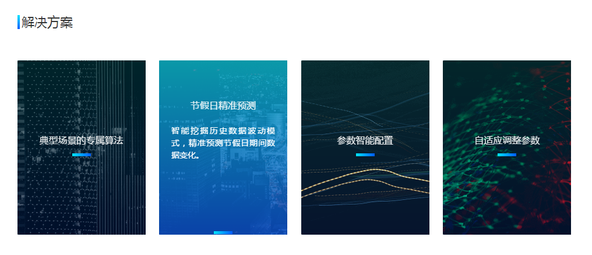
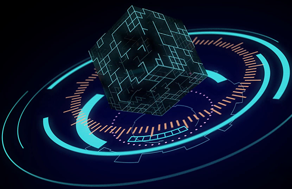

最近的一个项目的首页参考了两个网站的动画效果

[智能运维](http://iops.ai/),圆球一直匀速旋转。

[百度智能运维](http://aiops.baidu.com/#/product/intelligentProduct),背景图片一直匀速来回移动，鼠标移入时标题和渐变小条分别往上和往下匀速移动到固定的某一位置，同时中间的简介显示，鼠标移出匀速回到初始状态。
# **代码实现**
1. HTML
```html
<div id="testPage">
    <div class="topBar">
        
    </div>
    <div class="bottomBar">
        <ul>
            <li>
                <!--左右移动的背景图-->
                <div class="mask"><!--遮罩层-->
                    <p class="title">节假日节假日</p><!--标题-->
                    <p class="introduce">节假日节假日节假日节假日节假日节假日节假日节假日节假日</p><!--简介-->
                    <!--小条-->
                </div>
            </li>
        </ul>
    </div>
</div>
```
2. CSS
```css
#testPage{
    width: 100%;
    .topBar{
        height: 420px;
        background-color: #17263d;
        position: relative;
        overflow: hidden;
        .ball{
            position: absolute;
            left: 50%;
            top: 14px;
            margin: 0 0 0 -440px;
            animation: spin 90s linear infinite;  //使用旋转动画，动画名称 完成时间 速度曲线(线性) 重复次数(无线循环)
        }
        @keyframes spin {   //定义旋转动画
            from { transform: rotate(0deg); }
            to { transform: rotate(360deg); }
        }
    }
    .bottomBar{
        padding-top: 80px;
        ul{
            width: 1280px;
            margin: 0 auto;
            padding: 0;
            display: flex;
            justify-content: space-between;
            li{
                list-style: none;
                width: 280px;
                height: 354px;
                overflow: hidden; //隐藏图片超出的部分
                position: relative; //父相对定位，子(背景img和遮罩层div.mask)绝对定位
                >img{
                    width: 460px; //图片宽比li大一些
                    height: 354px;
                    position: absolute;
                    top: 0;
                    left: -90px; //初始状态显示图片的中间位置，(460-280)/2=90
                    animation: imgmove 40s linear infinite;
                }
                @keyframes imgmove
                { 0% {left: -180px;}   50% {left: 0px;}   100% {left: -180px;} } //背景图片要移动到边界，需要向左或者向右2*90=180
                .mask{
                    position: absolute;
                    top: 0;
                    left: 0;
                    width: 216px;
                    height: 100%;
                    padding: 0 32px;
                    color: #fff;
                    font-family: Microsoft YaHei;
                    letter-spacing: 1px;
                    background: rgba(15,28,48,0.8); //初始背景色
                    transition: background 0.5s; //0.5s内变换背景色
                    .title{
                        font-size: 20px;
                        margin: 144px 0 0;
                        transition: margin-top 0.5s;
                    }
                    .introduce{
                        position: absolute; //绝对定位于.mask中，不然.title和小条img改变margin的时候会跟着滑动
                        left: 0;
                        top: 0;
                        text-align: left;
                        font-size: 14px;
                        line-height: 30px;
                        height: 120px;
                        color: #fff;
                        font-family: Microsoft YaHei;
                        margin: 116px 0;
                        padding: 0 42px;
                        opacity: 0; //初始透明度，完全透明
                        transition: opacity 0.5s; //0.5s内变换透明度
                    }
                    img{
                        margin: 20px 0 168px; //初始margin
                        transition: margin 0.5s;  //0.5s内变换外边距
                    }
                    &:hover{ //hover的时候要变成的样子
                        background: linear-gradient(rgba(0, 178, 217,0.8), rgba(13, 43, 111, 0.8));
                        .title{
                            margin-top: 78px; 
                        }
                        .introduce{
                            opacity: 1;
                        }
                        img{
                            margin: 239px 0 1px;
                        }
                    }
                }
            }
        }
    }
}
```