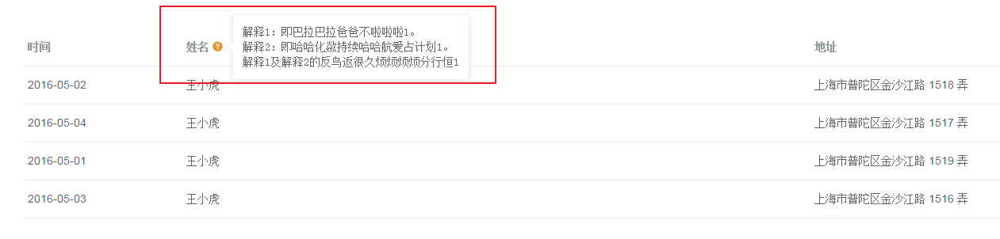
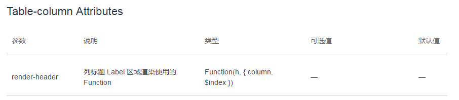
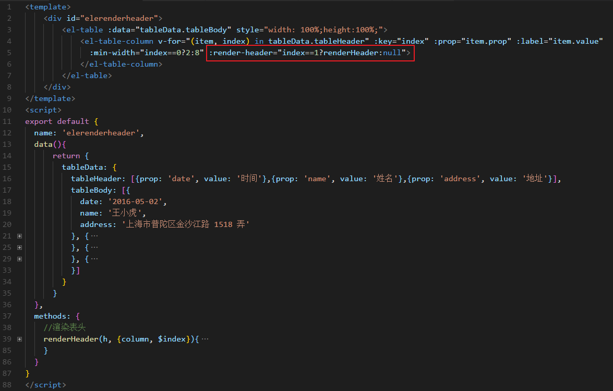
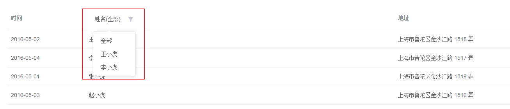
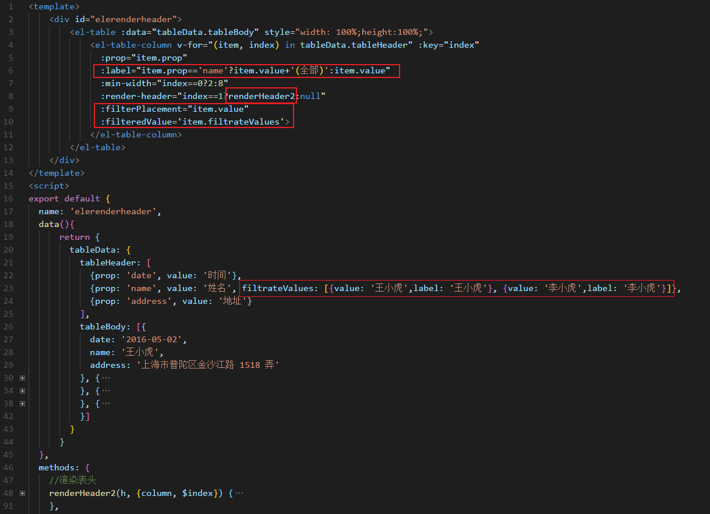

目前所做的项目都是后台管理系统，前端框架用的VUE，为了开发速度快，我们都会选择合适的组件库。诶！饿了么团队开发的elementUI就被我们选中啦。
用起来还是很顺手的，后台系统的基本功能都有示例代码，很方便，但是有些特殊的功能没有示例代码，只是文档中有简单的说明，这个只能去网上搜索一些大神的博客来帮忙啦。
因为所用的版本是2.0.11，所以本文所讲都是该版本的表格，后续版本有新增另外的方法，注意看自己所用的版本号是否有本文所讲的属性。
# **拦路虎**

如上图，有时我们需要对表头字段作一些解释
# **打虎**
[elementUI官网](http://element-cn.eleme.io/#/zh-CN/component/table)只给了一个属性解释，没有任何示例代码：

网上搜罗一番，结合自己的需求写成如下代码：
html代码如图：

JS代码如下：
```javascript
renderHeader(h, {column, $index}){
    return h(
        "el-popover",
        {
            props: {
                placement: "right",
                trigger: "hover",
                popperClass : "popperClassResOut"
            }
        },//此对象是定义el-popover的各属性
        [
          // h(
          //     "div",
          //     [`解释1：即巴拉巴拉爸爸不啦啦啦。`]
          // ),
          // h(
          //     "div",
          //     [`解释2：即哈哈化歘持续哈哈航爱占计划。`]
          // ),
          // h(
          //     "div",
          //     [`解释1及解释2的反鸟返很久烦烦烦烦分行恒`]
          // ),
            h(
                "div",
                [
                    `解释1：即巴拉巴拉爸爸不啦啦啦1。`, 
                    h('br'), 
                    `解释2：即哈哈化歘持续哈哈航爱占计划1。`, 
                    h('br'), 
                    '解释1及解释2的反鸟返很久烦烦烦烦分行恒1'
                ]
            ),//这个h函数可以替代上方注释的代码
            h(
                "span",
                {
                    slot: "reference"
                },
                [
                    column.label,
                    h("i", {
                        class: "el-icon-question",
                        style: {
                            marginLeft: "4px",
                            cursor: "pointer",
                            color: "#ea9518",
                        }
                    })
                ]
            ),//这个h函数是渲染问号图标和被解释的表头字段文字
        ]
    )
}
```
仔细观察上面的h函数，第一个参数：标签名(字符串)，第二个参数：标签属性(对象)，第三个参数：第一个参数的子元素(数组)，数组的元素又重复h函数。
其实这个h函数就是在写html代码，其中的层级关系自己很好把握。
# **又有大老虎**
如果表头有筛选

# **打不死你才怪**
那么数据绑定有一些更改，如下图

JS代码如下：
```javascript
renderHeader2(h, {column, $index}) {
    let filters = [{value:"", label:'全部'}];
    for(let item in column.filteredValue){
        filters.push(column.filteredValue[item])
    }
    return h('div',{
        style: {
            height: '30px'
        },
    },
    [
        h(
            "el-select",
            {
            props: {
                placeholder: '',
                value: column.label,  //‘姓名’
                clearable: false,
                popperClass:'popperClassResOut',
            },
            class: 'filtersSelect', //下拉选择框的类名，方便调整样式
            on: {
                input: value => {
                    if(value != ''){
                        column.label = column.filterPlacement+'('+value+')'
                    }else{
                        column.label = column.filterPlacement+'(全部)'
                    }
                    // this.callback && this.callback();
                }
            } //下拉选择触发的事件
            },
            [
            filters.map(item => {
                return h("el-option", {
                props: {
                    value: item.value,
                    label: item.label
                }
                });
            })
            ] //下拉选项
        )
    ])
},
```
下拉框的样式如下：
```css
#elerenderheader .filtersSelect{
    vertical-align: middle;
    padding: 0px;
    margin: 0px;
}
#elerenderheader .filtersSelect div{
    white-space: normal;
    padding: 0px;
    margin: 0px;
}
#elerenderheader .filtersSelect .el-input input{
    background-color: transparent;
    border: none;
    width: 110px;
    padding: 0 5px;
    font-size: bold;
}
#elerenderheader .filtersSelect .el-input__icon{
    width: 16px;
    height: 16px;
    background-image: url("../assets/ic_sx.png"); //漏斗图标
    background-size:16px 16px;
    background-repeat:no-repeat;
    vertical-align: middle;
}
#elerenderheader .filtersSelect .el-input__icon:before{
    content: '';
}
#elerenderheader .filtersSelect .el-select__caret{
    transform: none;
    -webkit-transform:none;
}
```