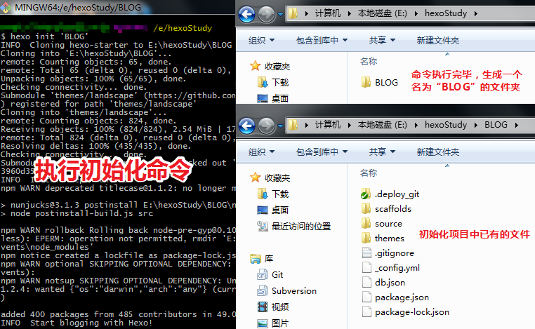
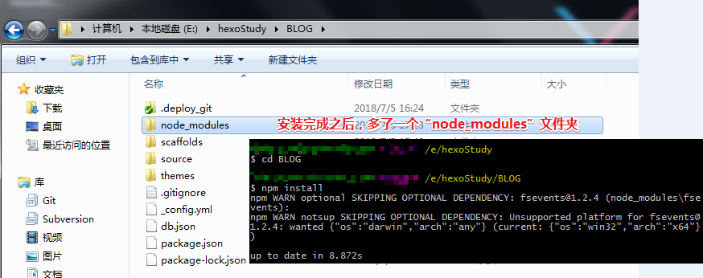
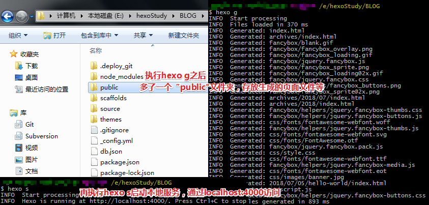
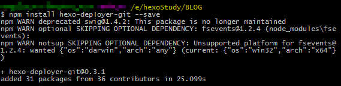
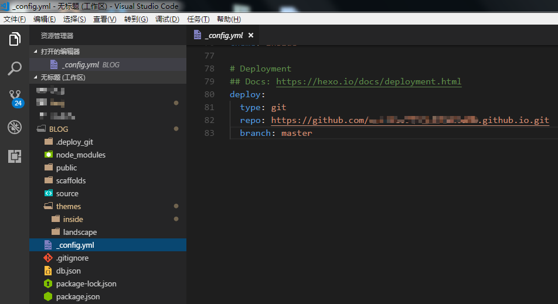
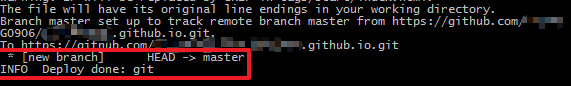

终于把hexo静态博客搭好了，但这还只是第一步，革命尚未成功，妹子仍需努力呀！
第一篇博客那当然要写写我是怎么搭建这个博客的，为了篇幅小一些，这篇只讲简单的搭建和部署到gitHub上。
下面进入正题：
看看移动端效果吧，下图是我修改了主题、写了两篇测试文章之后的效果：


# **准备工作**
想必看到这篇文章的你一定也是代码的搬运工，准备工作以及一些命令或术语就不多赘述
### 一、github & gitbash
* 要用github搭建静态博客，当然首先得[官网](https://github.com/)注册一个github账号，然后创建一个远端库，命名规则：YOUR_gitHub_NAME.github.io
* 接着去[官网](https://git-scm.com/downloads)下载对应系统的gitbash客户端，用于上传代码等

### 二、node
因为需要通过npm安装hexo的安装包、依赖包及插件等，所以需要去[官网](http://nodejs.cn/download/)下载对应系统的node安装包，这个安装包包含了npm包管理工具，然后就可以使用npm命令下载相关包或插件

# **开工搭建**
现在开工，做博客。以下的所有命令，可以在DOS窗口下敲，也可以用gitbash。
### 一、安装hexo
```bash
    $ npm install -g hexo #全局安装hexo安装包
```
### 二、初始化hexo项目
```bash
    $ hexo init *FLOD_NAME*  #FLOD_NAME是你初始化hexo的项目名字
```
** 注：** 先进入非中文目录（像我是进入E盘的hexoStudy文件夹下）再执行这句命令，初始化一个名为“BLOG”的项目。


### 三、安装依赖包
```bash
    $ cd BLOG #进入项目目录
    $ npm install #安装依赖包(npm i也可以，你懂的)
```

### 四、生成文件&启动服务
```bash
    $ hexo generate #编译,生成静态文件,也就是public文件夹的东西(hexo g也可以)
    $ hexo sever #开启本地服务(hexo s也可以)
    #以上两行命令可以合并成一行：hexo s -g
```

### 五、本地访问


# **部署到gitHub，让所有人看到**
前面的步骤只是实现了本地访问，想要让所有人都看到还需要把博客部署到gitHub上。
### 一、安装hexo关于git的管理组件
```bash
    $ npm install hexo-deployer-git --save #回到项目根目录安装
```

### 二、修改配置文件
** 注：**修改项目根目录下的_config.yml文件的deploy属性

### 三、部署到gitHub，网址访问博客
```bash
    $ hexo deploy #部署到gitHub(hexo d也可以)
```

看到“Deploy done: git”就说明完成了，不确定可以再去gitHub上的仓库看看
地址栏输入：YOUR_gitHub_NAME.github.io就可以访问了，炒鸡简单有木有

# **最后的最后**
+ gitHub上只能部署静态博客(大家都懂的)
+ 仔细看gitHub上我们的这个项目的文件是和本地不一样的，如果想在多台电脑上编辑管理这个项目，有两种方法可以借鉴：
    1. 再建一个仓库上传本地代码，在别的电脑上拉取代码(个人倾向这种方法)
    2. 远端仓库拉个分支(请自行百度)
+ 初体验到此就结束了，后面再讲更换主题和写文章

