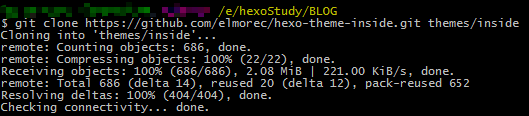
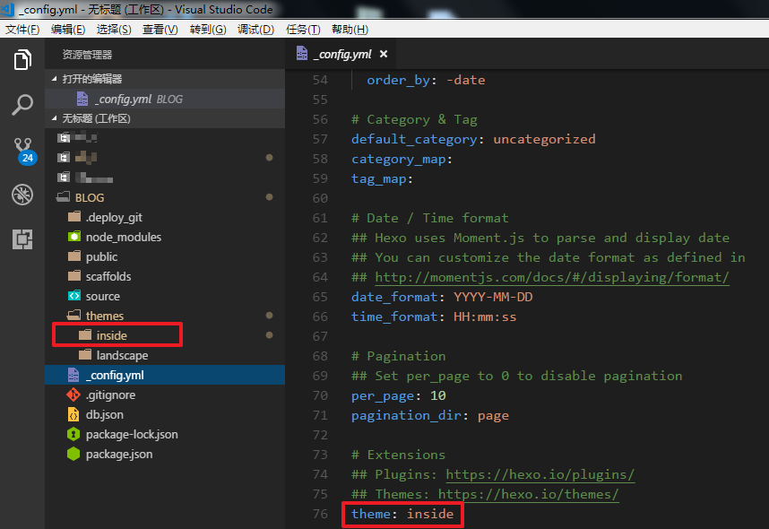
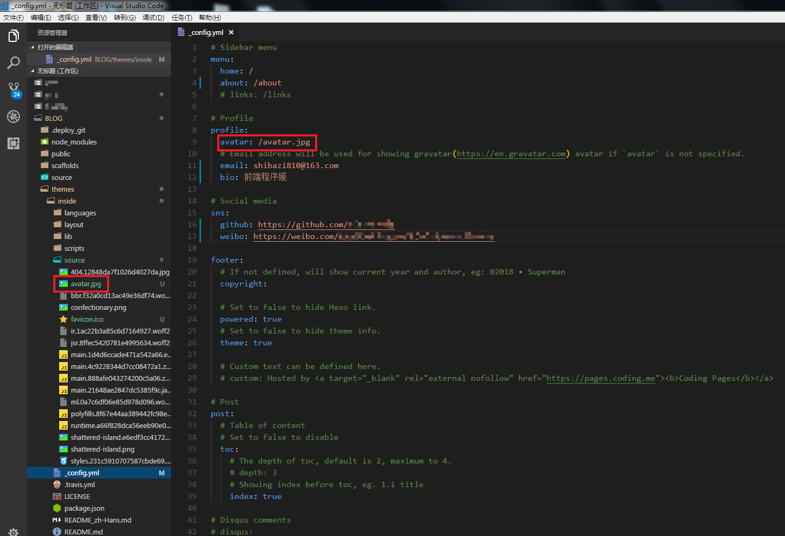
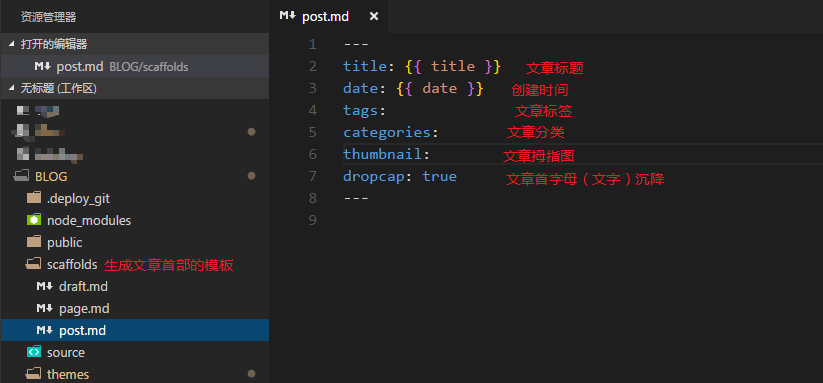
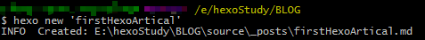
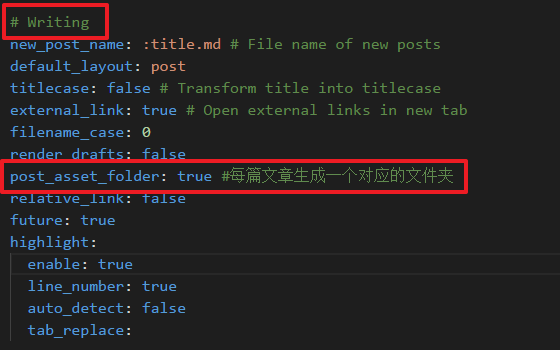
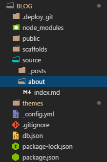

默认的hexo主题我个人觉得不是很好看，必须得挑一款适合自己风格的主题
写博客需要懂一些Markdown语法，so easy的啦，网上一搜一箩筐的语法博客(只能帮你到这儿了)

## 主题修改
#### 找一个能折腾的主题
[hexo官网](https://hexo.io/zh-cn/)上有很多主题可供选择，个人建议，刚开始做的时候选择一些简单的主题来折腾，会没那么折腾
我找了很久，找到一个简单小清新的主题，很是喜欢，然后就开始折腾吧
主题下载地址呈上：[inside主题](https://github.com/elmorec/hexo-theme-inside.git)

#### 下载主题
在项目根目录把主题从gitHub上克隆下来
```bash
    $ git clone *URL* themes/*themeName*  #URL是主题地址，themes/*themeName*是主题存放的位置(通常都放在themes文件夹下)和名称
```

#### 修改配置
主题有了，需要全局配置一下才能生效。打开项目根目录下的_config.yml文件作修改并保存，执行**hexo s**启动本地服务查看效果

**注：**如果刷新页面没有效果，那么需要清除一下缓存文件和静态文件，执行一下命令：
```bash
    $ hexo clean
```
然后再执行**hexo s -g**重新生成静态文件并启动本地服务，再刷新就能看到我清新可爱风的主题了
#### 修改头像
我的博客怎么能没有我的头像呢，赶紧把我的头像图片拷进去，然后进行配置修改

头像放在themes>inside>source下，修改themes>inside>_config.yml>profile

## 写博客
写到这儿，重头戏终于登场了。做自己的博客，最重要的当然是写博客记录自己所学啦。**记得把Markdown语法翻出来哦**
#### 配置文章首部

title、date、tags、categories是必须项，其中tags和categories与页面上tags和categories这两个导航有关，需要写上，不然这两个导航点击之后页面会报错而且没有任何跳转，而且给博客写上标签和分类也利于自己和读者按需查找。
thumbnail属性目前我还没找到怎么解决图片路径的问题，可以忽略不计
#### 创建博客文件
```bash
    $ hexo new *fileName* #fileName是文件名
```

如果文章中有很多图片，需要一个专门的文件夹来存放比较好，所以需要**全局**配置一下，即修改根目录下的_config.yml文件

这样执行**hexo new**命令之后会同时生成同名的文件夹(这个文件夹就拿来放图片)和.md结尾的markdown文件
#### 写博客内容
写吧写吧，想写啥就写啥！

## about
就是“关于我”这个导航啦，这个需要在source下创建一个about文件夹以及一个index.md文件


## 最后的最后
1. 编写完了之后，最好**hexo clean**清除缓存文件，然后再**hexo g**重新生成文件，最后别忘了**hexo d**推送到远端gitHub仓库
2. hexo的官网上还有很多东西在目前我还没有用到就没有写进来，想了解更多可以去[hexo官网](https://hexo.io/zh-cn/)上了解实践
3. 目前还只是静态博客，只能通过gitHub的地址访问(如果有自己的域名和服务器也可以部署到自己的服务器上，用自己的域名访问，自行百度吧)，这样毕竟是不方便的，所以要做成动态的，这就需要自己写后台管理系统前端页面以及后台处理程序，目前正在学习中，后续搞定了再来写一篇博客记录一下


