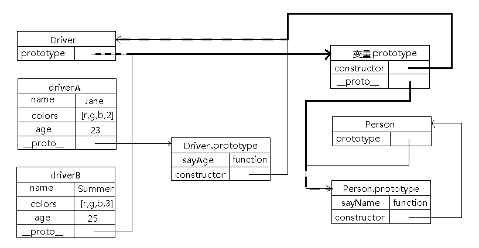

从创建这个博客开始，第一篇博客是2018.07.10，到今天2019.07.20已经整整一年了，回头看博客的数量才寥寥11篇，平均一个多月才一篇，汗颜！
最近有换工作的想法，但又觉自己的一些基础知识不牢固，同时这些基础知识也是面试中会考察的，所以给自己定下一个小目标，每周总结一篇面试中会考察的知识点，一为巩固知识，二为准备面试，三为自己养成一个擅于积累总结的好习惯。

第一个要总结的就是javaScript的继承方案。javaScript的继承我一直不太理解，觉得很复杂，最近查阅了好些博客之后发现，需要结合图来理解就容易理解很多。

# **为什么需要继承**
因为需要复用。一段代码需要复用可以用函数来实现，但是对象要复用呢，就需要继承。JS（ES6以下）不像其他强类型语言一样有类Class，所以只能通过原型来实现继承。
# **想要的继承效果**
我们希望的是可以向构造函数传递参数实现实例对象的属性赋值，同时多个实例对象的属性相互不干扰，但函数是多个实例对象共享的。即属性不共享，函数共享。
# **继承依据的主要原理**
原型链可以用来实现共享，构造函数可以让实例对象各自拥有自己的属性，互不干扰。

***JS继承有很多种方式，各有千秋，我一一道来***

***正式讲之前，先说一下构造函数、实例对象、原型对象之间的三角关系,一图胜千言***


***先声明父类构造函数，用于原型链继承和借用构造函数继承***
```javascript
    // 父类构造函数
    function Person(name){
        this.name = name;
        this.sayName = function() {
            console.log(this.name);
        }
    }
    Person.prototype.age = 10;
```
# **一、原型链继承**
```javascript
    // 原型链继承
    function Coder() {
        this.name = 'Jane';
    }
    // 这里是关键，创建Person的实例，并将该实例赋值给Coder.prototype
    Coder.prototype = new Person();
    var coder1 = new Coder();
    console.log(coder1.age); // 10
    console.log(coder1 instanceof Person); // true。instanceof用于判断构造函数的prototype属性是否在实例对象的原型链上
```

**疑惑点**：属性name在实例coder1中而不在构造函数Coder中；属性name和sayName在Coder.prototype中而不在构造函数Person中。
**知识点**：name和sayName都是实例属性，实例在哪里创建，实例属性就出现在哪里
**特点**：实例可以继承的属性有：实例的构造函数的属性，父类构造函数的属性，父类原型的属性
**缺点**：新实例无法向父类构造函数传参；多个实例共享属性导致实例对[***引用类型***]的操作会被篡改
```javascript
    // 演示：篡改父类引用类型的属性 colors是引用类型，height是基础类型
    function Person(){
        this.colors = ['red', 'blue', 'green']; // 【1】
        // this.height = 100; 【1`】
    }
    // Person.prototype.colors = ['red', 'blue', 'green']; // 【2】
    // Person.prototype.height = 100; 【2`】
    function Coder() {
        // this.colors = ['red', 'blue', 'green']; // 【3】
        // this.height = 100; 【3`】
    }
    // 这里是关键，创建Person的实例，并将该实例赋值给Coder.prototype
    Coder.prototype = new Person();

    var coder1 = new Coder();
    coder1.colors.push('yellow');
    coder1.height = 120;
    // 属性值沿着原型链，遵循就近原则。就近的属性值会屏蔽上层原型链的属性值
    console.log(coder1.colors, coder1.height); // ['red', 'blue', 'green', 'yellow'] 120

    var coder2 = new Coder();
    console.log(coder2.colors, coder2.height);
    // 【1】、【2】['red', 'blue', 'green', 'yellow']   【1`】、【2`】100；
    // 【3】['red', 'blue', 'green']   【3`】100
```
# **二、借用构造函数继承**
```javascript
    // 借用构造函数继承
    function Doctor() {
        // 用.call()和.apply()将父类构造函数引入子类函数，等于是复制父类的实例属性给子类（不用原型）
        Person.call(this, 'Summer');
        this.age = 20;
    }
    var doctor1 = new Doctor();
    console.log(doctor1.name, doctor1.age); // Summer 20
    console.log(doctor1 instanceof Person); // false
```

**特点**：可以向父类传参；可以继承多个构造函数属性（call多个）；每个实例属性各自独立，解决原型链继承中共享属性的问题
**缺点**：只能继承父类构造函数的属性和方法，不能继承父类原型的属性和方法；无法实现函数复用，每个子类实例都有父类构造函数的副本，影响性能
# **三、组合继承**(常用)
结合了以上两种模式的优点，传参和复用。利用原型链实现对父类原型属性和方法的继承，借用构造函数实现对父类构造函数的属性的继承。
```javascript
    // 组合继承的实现

    // 声明父类，构造函数内有基础类型属性和引用类型属性，原型上有一个方法
    function Person(name){
        this.name = name;
        this.colors = ['red', 'blue', 'green'];
    }
    Person.prototype.sayName = function(){
        console.log(this.name);
    };
    // 声明子类
    function Driver(name, age){
        // 第二次调用Person()
        Person.call(this, name); // 借用构造函数模式实现属性继承
        this.age = age;
    }

    // 第一次调用Person()
    Driver.prototype = new Person(); // 原型链继承实现方法继承
    // 重写Driver.prototype的constructor属性，指向自己的构造函数Driver
    Driver.prototype.constructor = Driver; 
    Driver.prototype.sayAge = function(){
        console.log(this.age);
    };

    var driver1 = new Driver('Nike', 29);
    driver1.colors.push('yellow');
    console.log(driver1.colors); // ['red', 'blue', 'green', 'yellow']
    driver1.sayName(); // 'Nike'
    driver1.sayAge(); // 29

    var driver2 = new Driver('Greg', 27);
    console.log(driver2.colors); // ['red', 'blue', 'green']
    driver2.sayName(); // 'Greg'
    driver2.sayAge(); // 27
```

**特点**：可以继承父类原型上的属性，可以传参，可复用；每个新实例传入构造函数的属性是私有的
**缺点**：使用子类创建实例对象时，其原型中会存在两份相同的属性/方法，即两次调用Person()创建实例的时候都往Person.prototype写入了name和age两个属性
# **四、原型式继承**
利用一个空构造函数作为中介，将某个对象直接赋值给空构造函数的原型
```javascript
    // 原型式继承的实现

    // 函数容器，用来输出对象和承载继承的原型
    // object()对传入其中的对象执行了一次[浅复制]，将构造函数F的原型直接指向传入的对象
    // ES5中存在Object.create()的方法，能够代替object方法
    function object(obj){
        function F(){}
        F.prototype = obj;
        return new F();
    }
    var person = {
        name: 'Jack',
        friends: ['a', 'b', 'c']
    };

    var PersonA = object(person);
    PersonA.name = 'Greg';
    PersonA.friends.push('d');

    var PersonB = object(person);
    PersonB.name = 'Linda';
    PersonB.friends.push('e');

    console.log(person.name); // Jack
    console.log(person.friends); // ['a','b','c','d','e']
```

**缺点**：多个实例的引用类型属性指向相同，存在篡改的可能；无法传参
# **五、寄生式继承**
```javascript
    // 寄生式继承的实现
    function createAnother(original){
        var clone = object(original); // 通过调用 object() 函数创建一个新对象
        clone.sayHi = function(){  // 以某种方式来增强对象,可以是新增属性或方法，这里是新增方法
            console.log('hi');
        };
        return clone; // 返回这个对象
    }
    var person = {
        name: 'Jack',
        friends: ['a', 'b', 'c']
    };
    var PersonC = createAnother(person);
    PersonC.sayHi(); // 'hi'
```

**特点**：在原型式继承的基础上，增强对象
**缺点**：同原型式继承
# **六、寄生组合式继承**(常用)
第三种继承方式————组合继承虽然实现了需求:共享函数，但不共享属性，可是它是有不足之处：我们在独立属性时只是希望实例有各自的属性就好了，不需要原型（SubType.prototype）中也存在属性，这就多余了。
SubType.prototype存在属性是因为它对SuperType做了实例化继承，我们将实例化继承换成浅拷贝继承便可以解决问题：
```javascript
    // 寄生组合式继承的实现

    //将组合继承中的实例化继承：
    //Driver.prototype = new Person();
    //改为浅拷贝继承：
    function inheritPrototype(subType, superType){
        var prototype = Object.create(superType.prototype); // 创建对象，创建父类原型的一个副本
        prototype.constructor = subType; // 增强对象，弥补因重写原型而失去的默认的constructor 属性
        subType.prototype = prototype;  // 指定对象，将新创建的对象赋值给子类的原型
    }

    // 父类初始化实例属性和原型属性
    function Person(name){
        this.name = name;
        this.colors = ['red', 'blue', 'green'];
    }
    Person.prototype.sayName = function(){
        console.log(this.name);
    };

    // 借用构造函数传递增强子类实例属性（支持传参和避免篡改）
    function Driver(name, age){
        Person.call(this, name);
        this.age = age;
    }

    // 将父类原型指向子类
    inheritPrototype(Driver, Person);

    // 新增子类原型属性
    Driver.prototype.sayAge = function(){
        console.log(this.age);
    }

    var driverA = new Driver('Jane', 23);
    var driverB = new Driver('Summer', 25);

    driverA.colors.push('2');
    driverB.colors.push('3');

    console.log(driverA.colors); // ['red', 'blue', 'green', '2']
    console.log(driverB.colors); // ['red', 'blue', 'green', '3']

    driverA.sayAge(); // 23
    driverA.sayName(); // Jane
    
    driverB.sayAge(); // 25
    driverB.sayName(); // Summer
```

**特点**：高效率，因为只调用了一次构造函数Person，因此避免了在Driver.prototype上创建不必要的、多余的属性；原型链保持不变，可以正常使用instanceof和isPrototypeOf()
**这是最成熟的方法，也是现在实现库的方法**