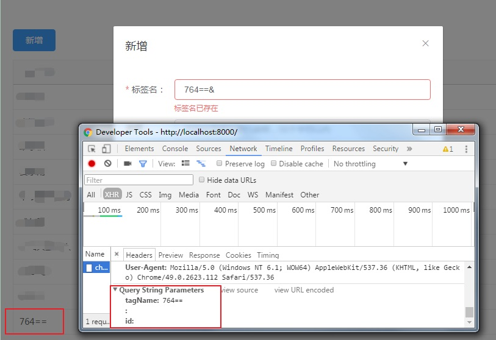

最近在工作中遇到一个bug:

# **背景**
新增或者编辑标签时，输入框失焦时需要校验标签名是否与已有标签名重复，而标签名只有字数限制（1-10个字符）。
# **问题**
校验的接口是get请求，当标签名以“#”、“&”结尾时，会出现一点小问题：比如已存在名为“aa”的标签，当输入“aa#”或“aa&”（这两个标签名不存在）失焦校验时，后台返回“该标签名已存在”，不应该啊，明明没有这个标签名呀？？？
# **找bug**
1. 首先想到的是打印一下输入框的值和传给后台的标签名，打印结果跟我输入的一样，嗯，那不是这里出问题
2. 然后F12打开开发者工具，发现失焦调用接口时，传的参数不是我填入的值，问题就出现在这儿了：以“#”结尾传的参是“aa”：
 
以“&”结尾传的参是“aa”，还莫名多了一个空字段的参数，值也为空：

# **Tell me why?**
想必这应该是http协议的问题，网上查阅了一番，参考[原文](https://blog.csdn.net/ergouge/article/details/8185219)讲解了URL的组成，举例一个URL:

> http://www.shibazi.com:8080/news/index.asp?boardID=5&ID=24618&page=1#name
从上面的URL可以看出，一个完整的URL包括以下几部分：
1、协议部分：该URL的协议部分为“http：”，这代表网页使用的是HTTP协议。在Internet中可以使用多种协议，如HTTP，FTP等等本例中使用的是HTTP协议。在"HTTP"后面的“//”为分隔符
2、域名部分：该URL的域名部分为“www.shibazi.com”。一个URL中，也可以使用IP地址作为域名使用
3、端口部分：跟在域名后面的是端口，域名和端口之间使用“:”作为分隔符。端口不是一个URL必须的部分，如果省略端口部分，将采用默认端口80
4、虚拟目录部分：从域名后的第一个“/”开始到最后一个“/”为止，是虚拟目录部分。虚拟目录也不是一个URL必须的部分。本例中的虚拟目录是“/news/”
5、文件名部分：从域名后的最后一个“/”开始到“？”为止，是文件名部分，如果没有“?”,则是从域名后的最后一个“/”开始到“#”为止，是文件部分，如果没有“？”和“#”，那么从域名后的最后一个“/”开始到结束，都是文件名部分。本例中的文件名是“index.asp”。文件名部分也不是一个URL必须的部分，如果省略该部分，则使用默认的文件名
6、锚部分：从“#”开始到最后，都是锚部分。本例中的锚部分是“name”。锚部分也不是一个URL必须的部分
7、参数部分：从“？”开始到“#”为止之间的部分为参数部分，又称搜索部分、查询部分。本例中的参数部分为“boardID=5&ID=24618&page=1”。参数可以允许有多个参数，参数与参数之间用“&”作为分隔符。

着重看第6、7条就能明白为什么以“#”和“&”结尾会出问题。“#”后面是锚，http自动去掉了“#”；“&”是参数分隔符，自然就多出了一个空字段，值也为空。
# **修复bug**

1. 参考[原文](http://www.w3school.com.cn/jsref/jsref_escape.asp)
escape(URIstring) 该方法不会对ASCII字母和数字进行编码，也不会对下面这些 ASCII 标点符号进行编码：  * @ - _ + . /  ，其他所有的字符都会被转义序列替换。返回值是已编码的string的副本，其中某些字符被替换成了十六进制的转义序列。

那就用这个吧，但是后台对于人民币符号“￥”并不能解码，那就试试其他的吧。

2. 参考[原文](http://www.w3school.com.cn/jsref/jsref_encodeuri.asp)
encodeURI(URIstring) 该方法不会对ASCII字母和数字进行编码，也不会对这些 ASCII 标点符号进行编码： - _ . ! ~ * ' ( ) 。该方法的目的是对 URI 进行完整的编码，因此对以下在URI中具有特殊含义的ASCII标点符号，encodeURI()函数是不会进行转义的：;/?:@&=+$,#

这个方法更不能用啦

3. 参考[原文](http://www.w3school.com.cn/jsref/jsref_encodeURIComponent.asp)
encodeURIComponent(URIstring) 该方法不会对ASCII字母和数字进行编码，也不会对这些ASCII标点符号进行编码： - _ . ! ~ * ' ( ) 。其他字符（比如 ：;/?:@&=+$,# 这些用于分隔URI组件的标点符号），都是由一个或多个十六进制的转义序列替换的。

诶，这个正是我需要的，试试这个，结果让人很满意，中英文的所有标点符号特殊字符都能进行编码。