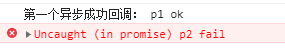

上一篇博客讲到浏览器的进程和线程、循环机制、微任务和宏任务，Promise在JS的循环机制中属于微任务,同时也是异步编程的一种解决方案。
# **Promise简介**
Promise可以看成是一个容器，装着一个异步操作（某个未来才会结束的事件）的结果。Promise操作后返回的对象是一个新的Promise对象，所以支持链式调用，可以把异步操作的流程以同步操作的流程表达出来，避免回调地狱，便于理解和阅读。

## Promise状态
1. Promise对象的状态不受外界的影响，它有三种状态：
	**pending：进行中**
	**fulfilled：已成功**
	**rejected：已失败**
	只有异步操作的结果才能确定Promise处于哪种状态，而且任何外界的操作都不能改变这个状态。这也是Promise（承诺）的由来。
2. Promise的状态一旦确定就不会再变，任何时候都可以得到这个结果，它的状态改变只有两种结果：
	**从pending状态变为fulfilled状态**
	**从pending状态变为rejected状态**
	只要有其中一种情况发生，状态就凝固了，不会再变，会一直得到这个结果，后续再添加Promise的回到函数也只能拿到前面凝固的状态。
## Promise的缺点
1. 无法取消。一旦新建，它就会立即执行，无法中途取消
2. 如果没有设置回调函数（没有捕获错误），Promise内部抛出的错误不会反应到外部
3. 当处于pending状态时，无法得知当前进展到哪个阶段（刚刚开始还是即将结束）
## 几个概念
异步：多个任务可以同时执行，互不影响
同步：多个任务必须排队，等待一个一个执行
串行：任务按顺序执行，前一个任务的结果可以是下一个任务的参数，所以必须等待前一个任务执行完毕才能往下继续
并行：多个任务可以同步执行，各不相干，实际是一个异步操作的过程

# **Promise API**
先来看看Promise都有哪些API：

从上图可以看出，Promise既是一个对象也是一个函数，下面就具体分析它的每个api:
## Promise.prototype.constructor()
基本用法：

```javascript
let promise = new Promise((resolve, reject) => {
	if(/*异步操作成功*/) {
		resolve(success);
	} else {
		reject(error);
	}
})
```
Promise接收一个函数作为参数，函数有两个参数：resolve和reject，这两个参数也都是函数，是Promise内置的两个方法，会在异步操作执行结束后调用，可以将异步操作的结果回传至回调函数，以确定Promise最终的一个状态（是fulfilled还是rejected）。
resolve（reject）方法的作用是将Promise的pending状态变为fulfilled（rejected），在异步操作成功（失败）之后调用，可以将异步操作的结果作为参数传递出去。
resolve和reject只有一个会执行，不会同时被执行，因为Promise只能保持一种状态。
## Promise.prototype.then()
Promise实例确认后，可以用then方法分别指定fulfilled状态和rejected状态的回调函数，基本用法如下：

```javascript
Promise.then(success => {
	console.log(success);
}, error => {
	console.log(error);
})
// 或者写成下面这种写法
Promise.then(success => {
	console.log(success);
}).catch(error => {
	console.log(error);
})
```
一般推荐第二种写法，因为第一种写法无法捕获resolve执行过程中抛出的错，具体代码如下：

```javascript
function createPromise(p, arg) {
	return new Promise((resolve, reject) => {
		setTimeout(() => {
			if(arg === 0) {
				reject(`${p} fail`);
			} else {
				resolve(`${p} ok`);
			}
		})
	})
}

createPromise('p1', 1).then(success => {
	console.log(`第一个异步成功回调： ${success}`);
	return createPromise('p2', 0);
}, error => {
	console.log(error);
})
```
执行结果如下：

如果换成第二种写法得到的执行结果：

如果Promise内部抛出的错不被捕获，是不会反应到外部的：

```javascript
function createPromise(p, arg) {
	return new Promise((resolve, reject) => {
		setTimeout(() => {
			if(arg === 0) {
				reject(`${p} fail`);
			} else {
				resolve(`${p} ok`);
			}
		})
	})
}

createPromise('p1', 0).then(success => {
	console.log(`第一个异步成功回调： ${success}`);
})
```

then还可以很好的解决异步串行操作的层层嵌套问题：

```javascript
$.ajax({
	url: '....',
	success: function(data) {
		$.ajax({
			url: '....',
			data: data,
			success: function(data) {
				$.ajax({
					url: '....',
					data: data,
					success: function(data){
						.....
					}
				})
			}
		})
	}
})
```
改造成Promise：

```javascript
createPromise('p1', 1).then(success => {
	console.log(`正在执行 ${success}`);
	return createPromise('p2', 1);
}).then(success => {
	console.log(`正在执行 ${success}`);
	return createPromise('p3', 1);
}).then(success => {
	console.log(`正在执行 ${success}`);
})
// 正在执行 p1 ok
// 正在执行 p2 ok
// 正在执行 p3 ok
```
## Promise.prototype.catch()
这个在前面的then方法里有讲到，能捕获resolve执行过程中抛出的错。这里不再赘述。
catch的多种写法：

```javascript
// 写法一
new Promise((resolve, reject) => {
	try {
		throw new Error('fail');
	} catch(e) {
		reject(e);
	}
}).catch(error => {
	console.log(error); // Error: fail
})
// 写法二
new Promise((resolve, reject) => {
	reject(new Error('fail');
}).catch(error => {
	console.log(error); // Error: fail
})
```
Promise错误具有‘冒泡’的性质，如果不被捕获会一直往外抛，直到被捕获为止：

```javascript
createPromise('p1', 0).then(success => {
	console.log(success);
	return createPromise('p2', 0);
}).then(success => {
	console.log(success);
	return createPromise('p3', 0);
}).catch(error => {
	console.log(error); // p1 fail
})
```
## Promise.prototype.finally()
finally方法用于指定不管Promise对象最后状态如何，都会执行的操作。

```javascript
createPromise('p1', 0).then(success => {
	console.log(success);
}).catch(error => {
	console.log(error); // p1 fail
}).finally(() => {
	console.log('finally'); // finally
})

createPromise('p1', 1).then(success => {
	console.log(success);
}).catch(error => {
	console.log(error); // p1 ok
}).finally(() => {
	console.log('finally'); // finally
})
```
finally方法不接受任何参数，故可知它跟Promise的状态无关，不依赖于Promise的执行结果。
## Promise.all()
Promise.all方法接受一个数组作为参数，但每个参数必须是一个Promise实例。Promise.all提供了并行执行异步操作的能力，并且在所有异步操作都执行完毕后才执行回调，只要其中一个异步操作返回的状态为rejected，那么Promise.all返回的状态就是rejected，此时第一个被reject的实例的返回值会传递给Promise.all的回调函数。

```javascript
// 两个Promise都成功，返回异步操作结果的数组
Promise
	.all([createPromise('p1', 1), createPromise('p2', 1)])
	.then(res => {
		console.log(res); // (2) ["p1 ok", "p2 ok"]
	});
// 其中一个Promise失败，返回失败的异步操作的信息
Promise
	.all([createPromise('p1', 0), createPromise('p2', 1)])
	.then(res => {
		console.log(res);
	}).catch(er => {
		console.log(er); // p1 fail
	});
// 两个Promise都失败，返回第一个失败的异步操作的信息
Promise
	.all([createPromise('p1', 0), createPromise('p2', 0)])
	.then(res => {
		console.log(res);
	}).catch(er => {
		console.log(er); // p1 fail
	});
```
如果Promise.all的Promise实例参数自己定义了catch方法，那么它一旦被rejected，就不会触发Promise.all的catch方法，而是执行then中的方法：

```javascript
let p1 = new Promise((resolve, reject) => {
	resolve('ok');
}).then(res => res).catch(e => e);
let p2 = new Promise((resolve, reject) => {
	throw new Error('报错了');
}).then(res => res).catch(e => e);
Promise.all([p1, p2])
	.then(res => console.log(res))
	.catch(e => console.log(e));
// (2) ["ok", Error: 报错了]
```
反之，如果Promise的实例参数自己没有定义catch方法，那就会触发Promise.all的catch方法：

```javascript
let p1 = new Promise((resolve, reject) => {
	resolve('ok');
}).then(res => res).catch(e => e);
let p2 = new Promise((resolve, reject) => {
	throw new Error('报错了');
}).then(res => res);
Promise.all([p1, p2])
	.then(res => console.log(res))
	.catch(e => console.log(e));
// Error: 报错了
```
## Promise.race()
Promise的race方法和all方法类似，都提供了并行执行异步操作的能力，但是all方法的效果实际上是「谁跑的慢，以谁为准执行回调」，而race方法则是「谁跑的快，以谁为准执行回调」，以下就是race的执行过程：

```javascript
	Promise
		.race([createPromise('p1', 1), createPromise('p2', 1)])
		.then(res => {
			console.log(res); // p1 ok
		});
		
	Promise
		.race([createPromise('p1', 0), createPromise('p2', 1)])
		.then(res => {
			console.log(res);
		}).catch(er => {
			console.log(er); // p1 fail
		});
```
## Promise.resolve()
> 语法：
> 1. Promise.resolve(value);
> 2. Promise.resolve(promise);
> 3. Promise.resolve(thenable);

它可以看作是new Promise()的快捷方式

```javascript
Promise.resolve('success');
// ====等价于====
new Promise(resolve => {
	resolve('success');
});
```
1. Promise.resolve()让Promise对象立即进入fulfilled状态，并将结果传递给回调函数，由于Promise.resolve()返回的一个Promise对象，因此可以用.then()方法处理其放回值。

```javascript
// 处理value
Promise.resolve('success').then(res => {
	console.log(res); // success
})
// 处理数组
Promise.resolve([1, 2, 3]).then(res => {
	console.log(res[0]); // 1
})
// 处理Promise
let p1 = Promise.resolve('this is p1');
let p2 = Promise.resolve(p1);
p2.then(res => {
	console.log(res); // this is p1
});
```
2. Promise.resolve()的另外一个作用就是讲thenable对象（即带有then方法的对象）转换为Promise对象。
```javascript
let p1 = Promise.resolve({
	then: function(resolve, reject) {
		resolve('this is an thenable object');
	}
})
console.log(p1 instanceof Promise); // true
p1.then(val => {
	console.log(val); // this is an thenable object
}).catch(error => console.log(error));
```
## Promise.reject()
> 语法
> Promise.reject(reson);

和上面的Promise.resolve()类似，它也是new Promise()的快捷方法。
```javascript
new Promise((resolve, reject) => {
	reject(new Error('error'));
});
// ====等价于====
Promise.reject(new Error('error'));
```
这段代码会让Promise对象立即进入rejected状态，并将错误对象传递给回调函数。
# **Promise的相关应用**
1. Promise一旦创建就会立即执行，中途无法取消。

```javascript
// 宏任务
new Promise((resolve, reject) => {
	console.log('new Promise');
	resolve('resolve'); // 微任务
}).then((success) => {
	console.log(success);
});
// 宏任务
setTimeout(() => console.log('setTimeout'), 0);
// 宏任务
console.log('console.log');
// new Promise
// console.log
// resolve
// setTimeout
```
new Promise()和console.log()属于script（全局宏任务），JS代码是从上至下执行的，所以先执行全局宏任务，当遇到Promise.resolve()这个微任务，待全局宏任务执行完就会立即执行微任务，当执行完微任务就会进行一次UI更新，然后再到任务队列中取出下个宏任务（setTimeout()），依次执行。

2. 如果不设置回调函数，Promise内部抛出的错误，不会反应到外部：

```javascript
createPromise('p1', 0).then((success) => {
	console.log(success);
})
console.log('console.log');
createPromise('p2', 1).then((success) => {
	console.log(success);
})
// console.log
// p2 ok
// uncaught (in promise) p1 fail
```
3. Promise状态一旦确定，就不会再变，任何时候都可以得到这个结果：
```javascript
new Promise((resolve, reject) => {
	resolve('resolve');
	reject('reject');
}).then((success) => {
	console.log(success); // resolve
}).catch((error) => {
	console.log(error);
})
```
在resolve后面抛出错误，不会被捕获，等于没有抛出。

4. 调用resolve或reject方法并不会终结其后面函数的执行：
```javascript
new Promise((resolve, reject) => {
	console.log(1);
	resolve('resolve');
	console.log(2);
}).then((success) => {
	console.log(success);
})
// 1
// 2
// resolve

// 一般来说，调用resolve或reject以后，Promise的使命就完成了
// 后续操作应该放在then方法里，而不应该写在resolve或reject的后面
new Promise((resolve, reject) => {
	console.log(1);
	return resolve('ok');
	console.log(2);
}).then((success) => {
	console.log(success);
})
// 1
// ok
```
5. Promise.all与Promise.race的应用对比：

```javascript
// 加载图片
function loadImg(url) {
	return new Promise((resolve, reject) => {
		let img = document.createElement('img');
		img.src = url;
		img.onload = function() {
			resolve(img);
		};
		img.onerror = function(error) {
			reject('img load is error');
		};
	})
}
// 显示多张图片
function showImgs(imgs) {
	imgs.forEach(function(item){
		document.body.appendChild(item);
	})
}
// 显示一张图片
function showImg(img) {
	document.body.appdendChild(img);
}
// Promise.all()
Promise.all([
	loadImg(url1), loadImg(url2)
]).then((success) => {
	console.log(success); // 只有所有的图片都加载出来了才会执行这里
	showImgs(success);
}).catch((error) => {
	console.log(error);
})
// Promise.race()
Promise.race([
	loadImg(url1), loadImg(url2), loadImg(url3)
]).then((success) => {
	console.log(success); // 谁先加载成功就打印谁，后面如果加载出错也不会被捕获
	showImg(success);
}).catch((error) => {
	console.log(error); // 如果先加载图片出错，则这里会打印
})
```