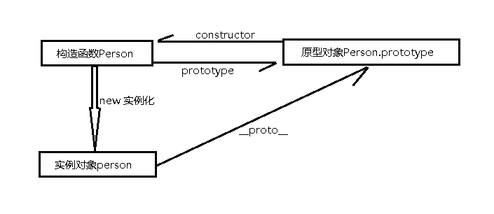
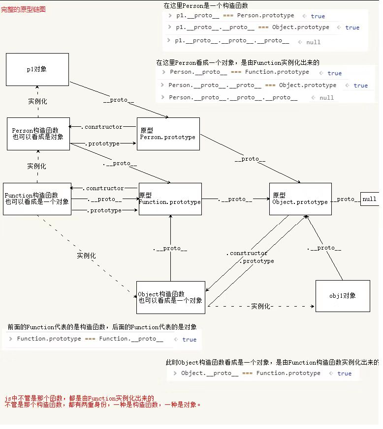

JavaScript是一门面向对象的设计语言，在JS里除了`null`和`undefined`，其余一切皆为对象，是对象就会有原型、构造函数、原型对象，就会有原型链。
之前写[javaScript的继承方案](https://lijing0906.github.io/post/jsInherit)时，讲到继承依据的原理就是构造函数、实例对象、原型对象之间的三角关系，这只是原型链上的一小部分。
今天详细梳理一下原型和原型链的知识。
[参考链接](https://juejin.im/post/58f94c9bb123db411953691b)
# **先解释一下三角关系**

JS采用构造器(`constructor`)生成一个新的实例对象(`instance`)，每个构造器都拥有一个`prototype`属性，指向该构造器原型(`prototype`)；每个通过此构造器生成的实例对象都有一个内部私有指针(`__proto__`)，也指向该构造器原型(`prototype`)，这也就保证了实例对象能够访问构造器原型中的属性和方法；构造器原型也有一个属性`constructor`，这个属性指回原构造器。（这段话中的构造器就是构造函数，构造器原型就是原型对象）
# **简单概括一下原型链**

这是完整的原型链，一图胜千言，理解了这张图就理解了JS的原型链。JS的继承就通过图中`__proto__`这条原型链实现。
* 如果试图访问对象(实例`instance`)的某个属性会首先在该对象内部寻找该属性，如果找不到，就在该对象的原型(`instance.__proto__`)里去找，若找到了便可以继承这个属性，如果该对象的原型上也没有，那就去`Object.prototype`上找，若找到了便可以继承这个属性，如果还找不到就报错，这种实例与原型的链条关系就是原型链，指的就是图中的`__proto__`指针链，图中有多条指针链。
* 原型链的顶层是`Object.prototype`，而这个对象是没有原型对象的，可以在控制台 `console.log(Object.prototype.__proto__);`，输出结果是`null`。
* 要明确一点：函数(`Function`)才有`prototype`属性，对象(除`Object`)拥有`__proto__``。
# **确定原型和实例的关系**
既然存在原型链，我们怎么去判断原型和实例的这种继承关系呢？
1. instanceof操作符

`instanceof`操作符用来测试对象是否是构造函数`new`出来的，这种说法比较狭隘，一种放之四海而皆准的说法是[测试构造函数的prototype属性是否出现在对象的原型链中的任何位置](https://developer.mozilla.org/zh-CN/docs/Web/JavaScript/Reference/Operators/instanceof)。返回`true`或`false`。
```javascript
    // 父类构造函数
    function Person(name){
        this.name = name;
        this.sayName = function() {
            console.log(this.name);
        }
    }
    Person.prototype.age = 10;
    // 原型链继承
    function Coder() {
        this.name = 'Jane';
    }
    // 这里是关键，创建Person的实例，并将该实例赋值给Coder.prototype
    Coder.prototype = new Person();
    var coder1 = new Coder();
    console.log(coder1.age); // 10
    // instanceof操作符检测
    console.log(coder1 instanceof Person); // true
```
2. isPrototypeOf()方法

跟`instanceo`f操作符作用相同，[isPrototypeOf() 方法用于测试一个对象是否存在于另一个对象的原型链上](https://developer.mozilla.org/zh-CN/docs/Web/JavaScript/Reference/Global_Objects/Object/isPrototypeOf),不同点是：
>`isPrototypeOf()`与`instanceof`运算符不同。在表达式 "`object instanceof AFunction`"中，`object`的原型链是针对`AFunction.prototype`进行检查的，而不是针对`AFunction`本身。

```javascript
// isPrototypeOf操作符检测
console.log(Person.prototype.isPrototypeOf(coder1)); // true
```