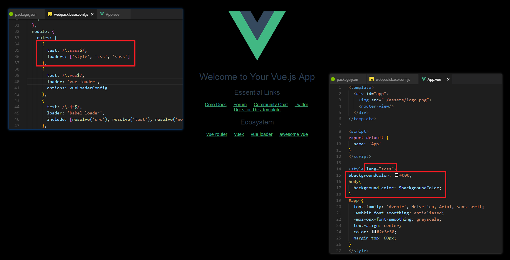
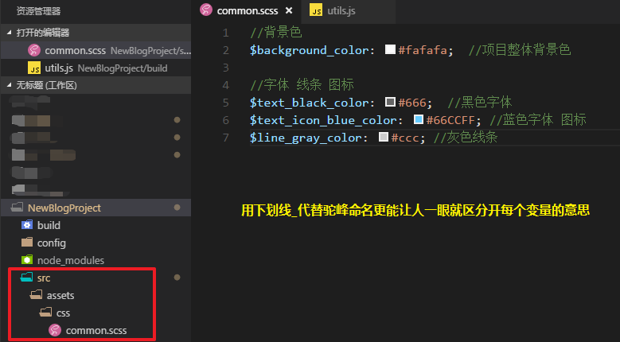
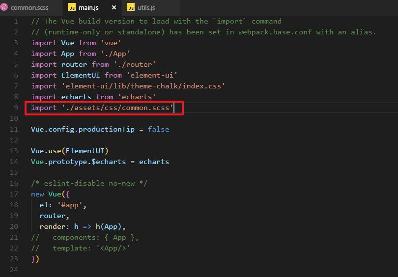
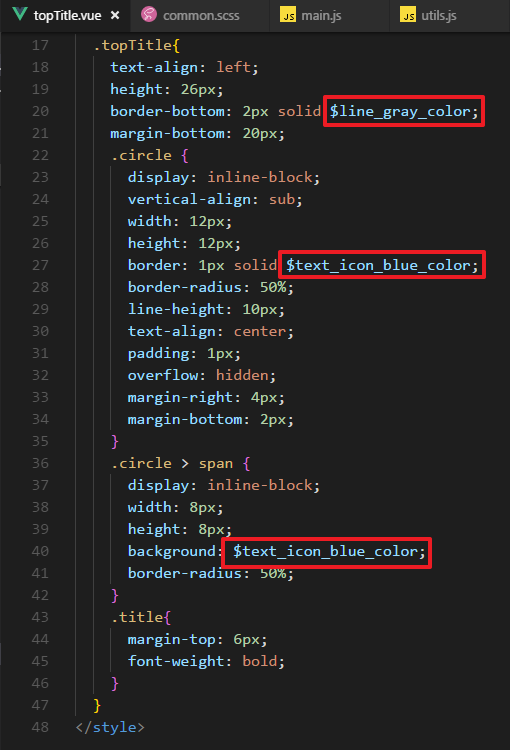
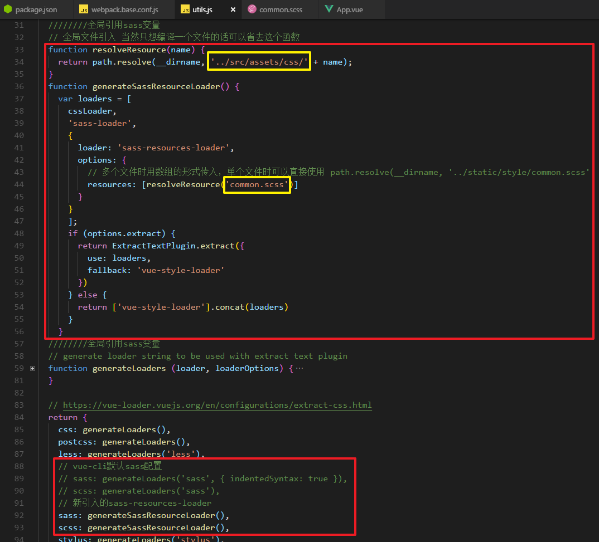
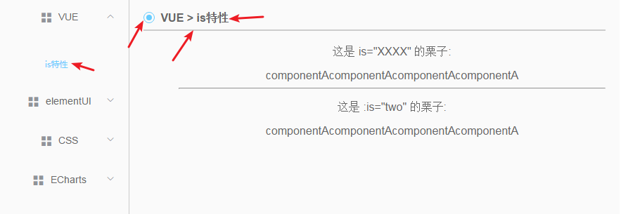

接近年底，工作没有那么忙，业余时间就比较多了，就想着把小demo整合到一起，自己搭建一个项目。
在网上找了两篇博客作为参考：[在vue中使用sass的配置的方法](https://blog.csdn.net/lily2016n/article/details/75309492)、[vue引入sass全局变量](https://blog.csdn.net/qq_27868533/article/details/79651659)
# **基础依赖包安装**
安装sass-loader和node-sass(sass-loader依赖于node-sass)。-D是--save-dev的缩写，依赖包在开发环境和生产环境都需要；对应的-S是--save的缩写，只需在生产环境需要。
```bash
    $ cnpm i node-sass sass-loader -D
```
# **webpack配置**
在build文件夹下的webpack.base.conf.js的rules里面添加以下配置代码：
```javascript
{
  test: /\.sass$/,
  loaders: ['style', 'css', 'sass']
}
```
# **写sass样式**
在App.vue文件中写上sass代码，测试配置是否成功。
```html
<style lang="scss">
    $backgroundColor: #000;
    body{
        background-color: $backgroundColor;
    }
</style>
```
# **启动项目看效果**
重启项目(cnpm run dev)会发现页面背景色变成黑色了。
如图：
# **全局引用sass变量**
全局样式如下图

在main.js中全局引入一个scss文件，然后在任何需要用到sass变量的文件中引用变量即可。


在其中定义变量在其他组件或者页面中引用报变量未定义错误，其他的样式可以正常显示，显然是编译的问题。
# **安装sass-resources-loader**
```bash
    $ cnpm i sass-resources-loader -D
```
# **修改sass配置**
在 build 文件夹下找到 util.js 修改sass编译器loader的配置
```javascript
    // 全局文件引入 当然只想编译一个文件的话可以省去这个函数
    function resolveResource(name) {
        return path.resolve(__dirname, '../src/assets/css/' + name);  //我把提取的样式放在src/assets/css下
    }
    function generateSassResourceLoader() {
        var loaders = [
            cssLoader,
            'sass-loader',
            {
                loader: 'sass-resources-loader',
                options: {
                    resources: [resolveResource('common.scss')]  // 多个文件时用数组的形式传入，单个文件时可以直接使用 path.resolve(__dirname, '../src/assets/css/common.scss'
                }
            }
        ];
        if (options.extract) {
            return ExtractTextPlugin.extract({  //要确保util.js有引入ExtractTextPlugin这个插件，通常都是有的
                use: loaders,
                fallback: 'vue-style-loader'
            })
        } else {
            return ['vue-style-loader'].concat(loaders)
        }
    }
```
修改sass配置的调用为 generateSassResourceLoader()
```javascript
return {
    css: generateLoaders(),
    postcss: generateLoaders(),
    less: generateLoaders('less'),
        // vue-cli默认sass配置
        // sass: generateLoaders('sass', { indentedSyntax: true }), 
        // scss: generateLoaders('sass'),
    // 新引入的sass-resources-loader
    sass: generateSassResourceLoader(),
    scss: generateSassResourceLoader(),
    stylus: generateLoaders('stylus'),
    styl: generateLoaders('stylus')
  }
```

# **引入文件，重启项目**
修改配置文件都需要重启项目。重启项目没有报错，全局样式生效
