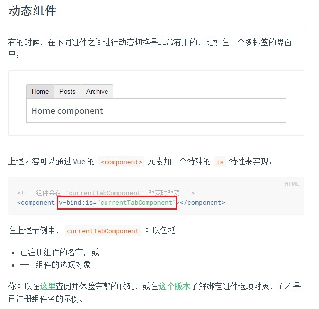
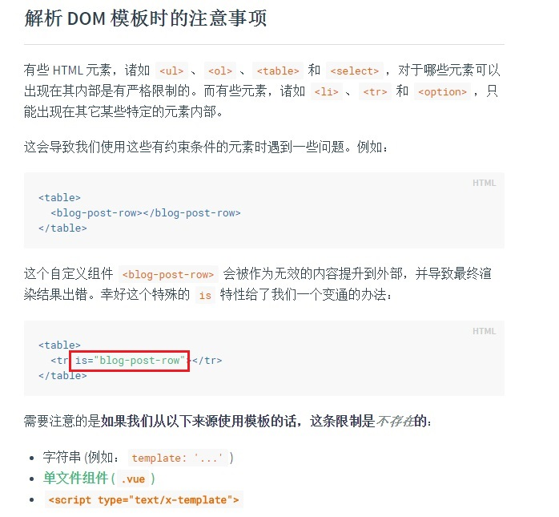
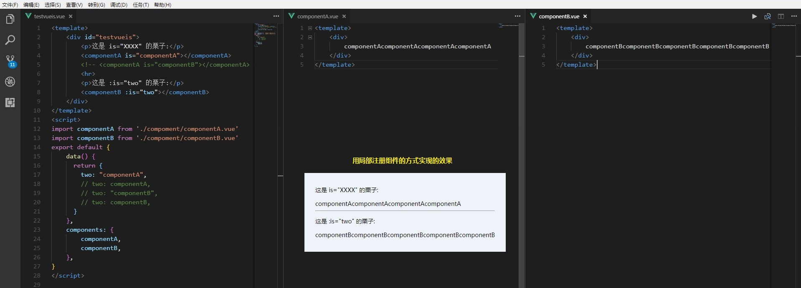
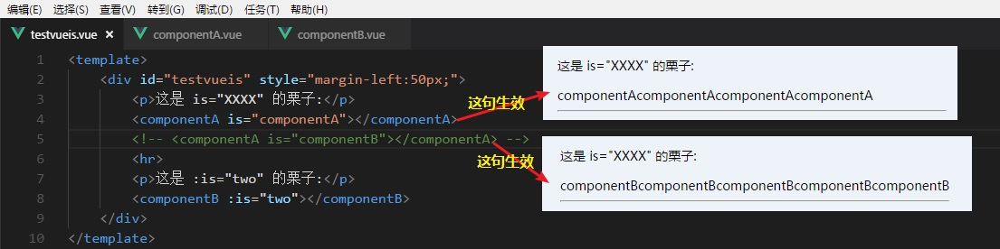
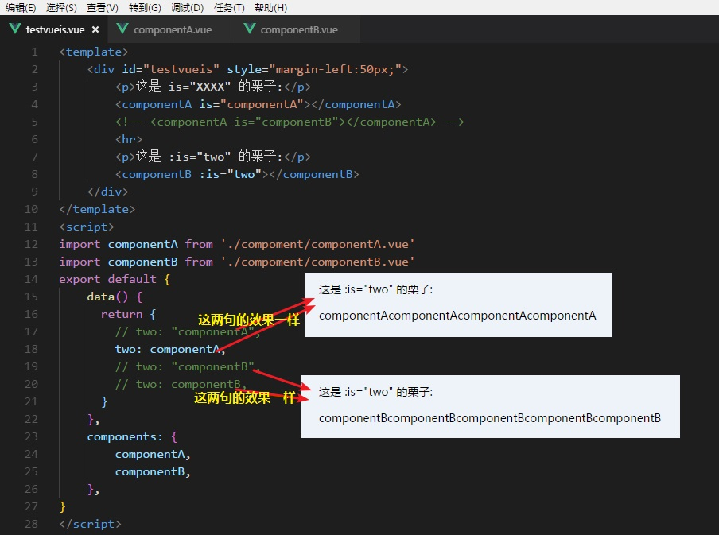

最近，工作之余在翻阅vue.js的官方文档，在查看到[动态组件](https://cn.vuejs.org/v2/guide/components.html#动态组件)和[解析 DOM 模板时的注意事项](https://cn.vuejs.org/v2/guide/components.html#解析-DOM-模板时的注意事项)的时候，讲到一个特殊的is特性，觉得很有意思，就来写一篇自己理解的总结。

# **现场**

# **写栗子实践**
其实看过之后，其实是有点懵的，这两个有啥区别，怎么用呢？

仔细分析，没那么难懂，参考[这篇博客](https://blog.csdn.net/qq_39397845/article/details/81062475)，我们也写一个栗子来试试

我们平时用局部注册的情况更多些，那我就写一个局部注册组件的栗子。

# **替换部分内容看渲染结果**
1. 单独看自定义组件componentA，把is="componentA"改成is="componentB"，会发现这部分的内容由原来的组件componentA的内容变成了componentB的内容

这里我们会发现，虽然标签是< componetA>,但是没有显示componentA的内容，而是显示componentB的内容，说明vue在渲染组件的内容时，是有检测is特性的，如果有被赋值那就渲染该值对应的组件的内容，如果没有is特性，那就渲染标签对应的组件内容。
那么如果把< componetA>换成< div>、< p>等等符合W3C的标签都能正常显示is被赋值的组件的内容！这样就与[解析 DOM 模板时的注意事项](https://cn.vuejs.org/v2/guide/components.html#解析-DOM-模板时的注意事项)不谋而合了！

2. 单独看自定义组件componentB，在父组件中能看到，是：is,这是数据绑定，那么被绑定的值必须在当前实例的data中定义。栗子中绑定的是two，two的值是什么那componentB就渲染什么。

同样，如果把< componetB>换成< div>、< p>等等符合W3C的标签都能正常显示：is被赋值的组件的内容！这样就是[动态组件](https://cn.vuejs.org/v2/guide/components.html#动态组件)了！

# **最后**
举栗子实践分析了一番，总算明白了一些，总结一下：
* 相同点：都能实现动态组件的效果
* 不同点：：is是数据绑定，绑定的值必须在data中定义，is被赋值的值须是子组件的名称