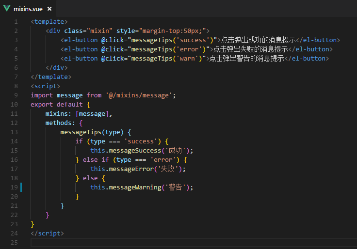

距离上次更新博客将近半年了，因为年后开始做一个大项目，多个产品经理各自负责一个或多个模块，一个模块相当于之前项目的整体。这次我一个人做一个模块，压力有些大，每天只想着把功能做出来，没有时间总结。
此次的一个大项目中用到了vue的混入（mixins），业余时间记录下来它的用法

# **为什么要用混入（mixins）**
页面中频繁使用某一种功能时，为了精简代码，就需要用到混入。
比如我们项目中会频繁用到elementUI的message消息提示，一些操作反馈的成功、失败、警告都要给用户消息提示，如果每个前端程序员在自己的每一个页面的每一个操作的执行代码中调用message组件的方法，代码量会很大。

# **使用对比**
不用mixins调用message方法，5行代码
```javascript
    this.$message({
        message: '提示文字',
        showClose: true, // 是否显示关闭按钮，true显示
        customClass: 'message-info-warn' // 自定义样式类名
    });
```
用mixins调用message方法，1行代码
```javascript
    this.messageSuccess('成功的提示文字');
```

# **如何实现**
### 混入function
在src目录下新建mixins文件，在此文件下新建message.js，里面写上相应的混入代码，如下图：


### 调用
在需要用到的文件中引入message.js，然后注册，最后调用就OK。如图所示：

点击相应的按钮弹出相应类型的消息提示（样式问题在下一篇博客中解决）：
